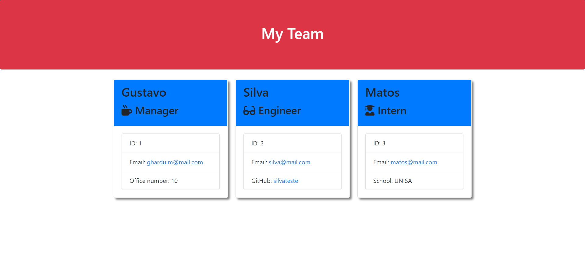

# Team Profile Generator

## Description

This application will allow the user to generate a site for their development team. The site will include each member's contact information as well as employee IDs and other pertinent professional information based on their role.

## User Story

```md
AS A manager
I WANT to generate a webpage that displays my team's basic info
SO THAT I have quick access to their emails and GitHub profiles
```

## Acceptance Criteria

```md
GIVEN a command-line application that accepts user input
WHEN I am prompted for my team members and their information
THEN an HTML file is generated that displays a nicely formatted team roster based on user input
WHEN I click on an email address in the HTML
THEN my default email program opens and populates the TO field of the email with the address
WHEN I click on the GitHub username
THEN that GitHub profile opens in a new tab
WHEN I start the application
THEN I am prompted to enter the team manager’s name, employee ID, email address, and office number
WHEN I enter the team manager’s name, employee ID, email address, and office number
THEN I am presented with a menu with the option to add an engineer or an intern or to finish building my team
WHEN I select the engineer option
THEN I am prompted to enter the engineer’s name, ID, email, and GitHub username, and I am taken back to the menu
WHEN I select the intern option
THEN I am prompted to enter the intern’s name, ID, email, and school, and I am taken back to the menu
WHEN I decide to finish building my team
THEN I exit the application, and the HTML is generated
```


### Demonstration

View a complete video demonstration of the application: [Professional Team Profile Generator Demo](https://drive.google.com/file/d/17LtuR6DN1_6txMWytjzDXenAQomS-SYo/view?usp=sharing)


### Output HTML


## Table of Contents

* [Description](#description)
* [Technologies](#technologies)
* [Installation](#installation)
* [Tests](#tests)
* [Usage](#usage)
* [Questions](#questions)

## Technologies

* [Node.js](https://nodejs.org/)
* [Inquirer.js](https://www.npmjs.com/package/inquirer)
* [Jest.js](https://jestjs.io/)

## Installation

To install dependencies, run the following:

```
npm init -y
```
```
npm install inquirer
```

## Tests

If the user wishes to test the code, install jest to the development dependencies using the following command; if there is no plan to test the code, please skip this section

```
npm install jest
```
After installed, the user uses the following command to run the tests
```
npm run test
```

## Usage

After installing the dependencies, run the application with

```
node app.js
```


## Questions

Questions about this repository? Please contact me at [gharduim@gmail.com](mailto:gharduim@gmail.com). View more of my work in GitHub at [Gustavo Harduim](https://github.com/gharduim) 
